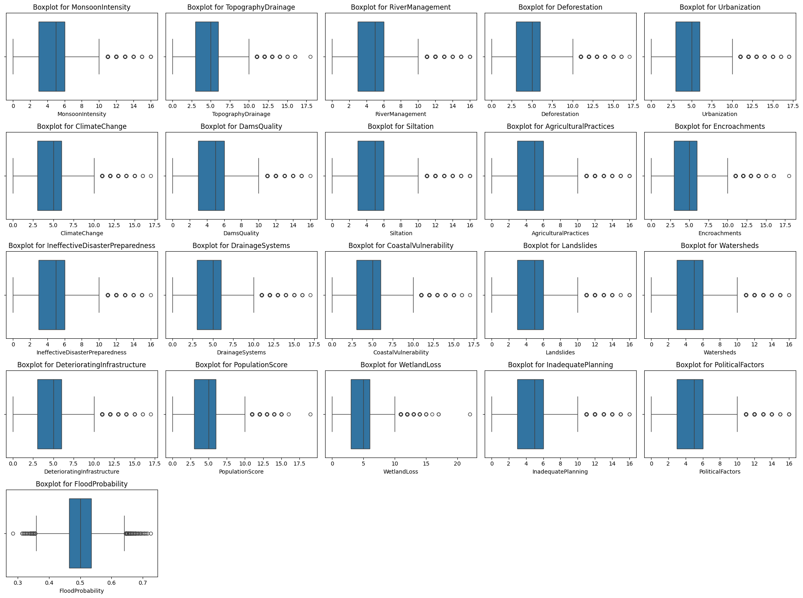
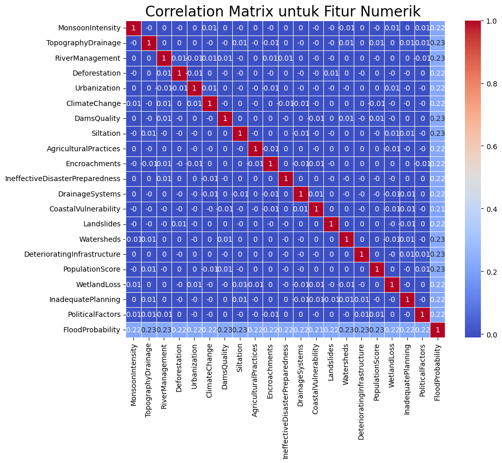
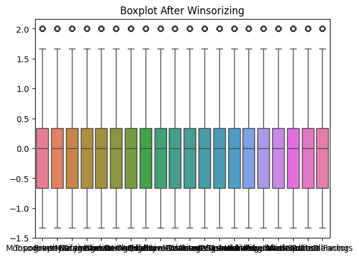
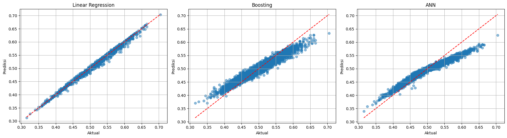

# Laporan Proyek Machine Learning - Nafa Khairunnisa
---
## Domain Proyek

Banjir merupakan bencana alam yang sering melanda Indonesia dan menimbulkan dampak besar, baik dari sisi korban jiwa maupun kerugian material. Dalam beberapa waktu terakhir, banjir telah terjadi di berbagai wilayah seperti Lampung, Kalimantan Tengah, Kalimantan Timur, dan Nusa Tenggara Barat (NTB). 

Di Lampung, banjir merendam sejumlah wilayah di Kota Bandar Lampung, berdampak pada 2.371 Kepala Keluarga (KK) dan menyebabkan tiga korban jiwa ([JawaPos](https://www.jawapos.com/berita-sekitar-anda/015914189/banjir-15-meter-masih-rendam-lampung-ribuan-kepala-keluarga-terdampak-tiga-korban-meninggal-dunia#google_vignette); [detikNews](https://news.detik.com/berita/d-7877881/banjir-bandang-terjadi-di-lampung-3-orang-tewas#:~:text=Sebanyak%20tiga%20orang%20meninggal%20dunia%20dalam%20bencana%20banjir,dievakuasi%20Badan%20Penanggulangan%20Bencana%20Daerah%20%28BPBD%29%20Provinsi%20Lampung.)). 

Di Kalimantan Tengah, seorang remaja tewas akibat terseret arus banjir di Barito Selatan ([Kompas](https://regional.kompas.com/read/2025/04/23/142854878/banjir-di-barito-selatan-memakan-korban-seorang-remaja-tewas-terseret-arus)), sementara di Dompu, NTB, banjir merendam puluhan ton jagung warga yang sedang dijemur ([Kompas](https://regional.kompas.com/read/2025/04/24/162936278/banjir-rendam-puluhan-ton-jagung-di-dompu-ntb)). Penyebab banjir ini beragam, mulai dari curah hujan tinggi hingga pasang air sungai seperti yang terjadi di Kutai Kartanegara ([Kompas](https://regional.kompas.com/read/2025/04/24/210037078/update-banjir-kutai-kartanegara-dan-penyebabnya)). 

Kondisi ini menunjukkan pentingnya pengembangan sistem deteksi dini dan prediksi risiko banjir secara lebih akurat dan adaptif.

Sebagai upaya untuk menghadapi tantangan ini, Badan Riset dan Inovasi Nasional (BRIN) telah mengembangkan teknologi deteksi dini. Beberapa inovasi mereka termasuk sistem pemantauan kelembaban tanah secara real-time, alat deteksi longsor (AdeL), pemantauan kesehatan struktur bangunan (INA-SHM), dan alat pengukur gelombang laut (SEGARA). Teknologi ini membantu memantau kondisi lingkungan dan memberikan informasi yang bisa digunakan untuk mengurangi dampak bencana ([Media Indonesia](https://mediaindonesia.com/humaniora/753130/brin-kembangkan-teknologi-deteksi-dini-mutakhir-untuk-hadapi-banjir#google_vignette)).

Namun, agar sistem ini bisa bekerja lebih maksimal, dibutuhkan pendekatan yang bisa menyesuaikan diri dengan kondisi yang cepat berubah, seperti perubahan cuaca dan iklim. Di sinilah peran teknologi berbasis data (data-driven) dan kecerdasan buatan (AI) menjadi penting. BMKG sendiri sudah mulai menggunakan AI untuk membantu memprediksi cuaca dan curah hujan agar bisa memberikan peringatan lebih cepat dan akurat. Hal ini menunjukkan bahwa teknologi AI semakin dibutuhkan dalam penanganan bencana. Beberapa penelitian juga sudah membuktikan bahwa AI dan machine learning mampu memberikan hasil yang baik dalam memprediksi banjir.

Studi oleh [Devi Fitrianah et al. (2022)](https://www.researchgate.net/profile/Wawan-Gunawan-3/publication/358962684_Studi_Komparasi_Algoritma_Klasifikasi_C50_SVM_dan_Naive_Bayes_dengan_Studi_Kasus_Prediksi_Banjir/links/629f5e0ca3fe3e3df865161e/Studi-Komparasi-Algoritma-Klasifikasi-C50-SVM-dan-Naive-Bayes-dengan-Studi-Kasus-Prediksi-Banjir.pdf) menggunakan algoritma klasifikasi Support Vector Machine (SVM), C5.0, dan Naïve Bayes untuk memprediksi tingkat kerentanan banjir dalam kategori banjir dan tidak banjir, serta mengevaluasinya menggunakan confusion matrix. Diperoleh nilai akurasi tertinggi yaitu 93,75% menggunakan algoritma SVM ataupun C5.0. Walaupun pendekatan yang digunakan adalah klasifikasi, studi ini menunjukkan bahwa fitur-fitur seperti curah hujan, kecamatan, debit air, luas wilayah, lama hujan, dan kepadatan penduduk memiliki kontribusi besar dalam prediksi banjir.

Pada tahun 2022, [Syamsurizal et al.](https://journal.irpi.or.id/index.php/sentimas/article/view/353) pernah membandingkan algoritma Naïve Bayes dan KNN untuk memprediksi banjir. Kedua algoritma ini digunakan untuk klasifikasi terjadinya banjir atau tidak di beberapa wilayah Jakarta. Hasilnya menunjukkan akurasi terbesar diperoleh oleh algoritma KNN yaitu 88,94% dan nilai error sebesar 11,06%.

Pada penelitian berjudul [Prediksi Banjir Di DKI Jakarta Dengan Menggunakan Algoritma K-Means Dan Random Forest](https://ejurnalunsam.id/index.php/jicom/article/view/8153), algoritma K-Means digunakan untuk proses clustering yang kemudian hasilnya dijadikan parameter dalam metode Random Forest. Hasilnya yaitu akurasi dan nilai F1-score terbaik terjadi pada k=14 dengan tingkat akurasi mencapai 95% dan nilai F1-score 90%. Artinya kedua algoritma ini mampu mengidentifikasi banjir secara akurat.

Penelitian lain pernah dilakukan oleh [Chika Stefanny P. S et al. (2025)](https://journal.ppmi.web.id/index.php/jdaics/article/view/1404) menggunakan Artificial Neural Network (ANN) untuk memprediksi banjir berdasarkan curah hujan. Hasilnya menunjukkan bahwa ANN memiliki kinerja yang baik dengan Mean Absolute Error (MAE) sebesar 0.0037 dan curah hujan merupakan faktor signifikan dalam mempengaruhi kejadian banjir.

Melihat potensi tersebut, proyek ini dibuat untuk mengembangkan model prediksi banjir menggunakan dataset [Flood Prediction Dataset](https://www.kaggle.com/datasets/naiyakhalid/flood-prediction-dataset) yang berisi 21 fitur untuk prediksi seperti curah hujan, kelembaban tanah, dan faktor geografis. Meskipun data yang digunakan berasal dari luar negeri, pendekatan ini tetap relevan untuk diuji di Indonesia.

Adapun algoritma yang akan digunakan untuk perbandingan antara lain Artificial Neural Network (ANN), yang sebelumnya telah digunakan untuk regresi, serta Linear Regression dan Gradient Boosting (GBR) sebagai tambahan pendekatan baru. Penelitian ini tidak bermaksud menggantikan sistem yang telah dikembangkan oleh BRIN, melainkan bertujuan untuk mengeksplorasi dan membandingkan pendekatan prediksi berbasis machine learning yang dapat menjadi pendukung sistem peringatan dini di masa depan.

---

## Business Understanding

### Problem Statements
- Model prediksi yang ada cenderung bersifat klasifikasi biner (banjir/tidak banjir), sedangkan pendekatan probabilistik atau kontinu lebih dibutuhkan untuk mendukung keputusan mitigasi berbasis risiko.
- Fitur-fitur yang digunakan pada model prediksi masih terbatas, meskipun sejumlah variabel penting seperti curah hujan dan kepadatan penduduk telah terbukti berkontribusi signifikan terhadap kejadian banjir.
- Model regresi pernah dibuat untuk prediksi banjir namun performanya berpotensi ditingkatkan dengan pendekatan dan model yang berbeda.

### Goals
- Mengembangkan model machine learning yang mampu memprediksi probabilitas banjir secara kontinu, bukan sekadar klasifikasi, agar hasilnya lebih fleksibel untuk perencanaan mitigasi.
- Mengidentifikasi fitur-fitur paling berpengaruh, termasuk curah hujan dan kepadatan penduduk, dalam membentuk model prediksi banjir yang akurat.
- Meningkatkan performa prediksi model secara terukur menggunakan data terbuka dari luar negeri sebagai representasi awal, yang dapat dievaluasi untuk potensi penerapan di Indonesia.

### Solution Statements
- Mengimplementasikan tiga algoritma regresi prediktif, seperti Linear Regression, Gradient Boosting (GBR), dan Artificial Neural Network (ANN), untuk membandingkan performa dan memilih model terbaik berdasarkan metrik evaluasi seperti MAE (Mean Absolute Error), RMSE (Root Mean Square Error), dan R² Score.
- Melakukan tuning hyperparameter dan feature engineering pada baseline model untuk mengoptimalkan akurasi prediksi, sekaligus mengurangi overfitting dan meningkatkan generalisasi.
- Menggunakan visualisasi hasil prediksi terhadap data aktual untuk memastikan model memiliki daya prediktif yang kuat.

## Data Understanding

Data yang digunakan untuk memprediksi banjir ini bersumber dari Kaggle, dengan nama [Flood Prediction Dataset](https://www.kaggle.com/datasets/naiyakhalid/flood-prediction-dataset). Dataset ini berisi 50.000 sampel dengan 21 kolom: 20 fitur dan 1 label target (`FloodProbability`).  
Meskipun sumber berbahasa Inggris, dataset ini dapat digunakan secara universal untuk negara manapun, sehingga cocok untuk studi kasus ini.

Berikut adalah deskripsi fitur-fiturnya:

- **MonsoonIntensity**: Curah hujan tinggi selama musim hujan dapat meningkatkan kemungkinan banjir.
- **TopographyDrainage**: Kemampuan daerah untuk mengalirkan air berdasarkan kondisi topografi.
- **RiverManagement**: Kualitas pengelolaan sungai.
- **Deforestation**: Tingkat deforestasi yang meningkatkan limpasan air.
- **Urbanization**: Urbanisasi memperbanyak permukaan keras, memperbesar risiko banjir.
- **ClimateChange**: Dampak perubahan iklim terhadap banjir.
- **DamsQuality**: Kualitas pemeliharaan bendungan.
- **Siltation**: Pengendapan lumpur di sungai dan waduk.
- **AgriculturalPractices**: Praktik pertanian yang dapat merusak struktur tanah.
- **Encroachments**: Pembangunan di jalur aliran air alami.
- **IneffectiveDisasterPreparedness**: Kurangnya kesiapsiagaan bencana.
- **DrainageSystems**: Kualitas sistem drainase.
- **CoastalVulnerability**: Kerentanan wilayah pantai terhadap banjir.
- **Landslides**: Risiko longsor yang dapat memperparah banjir.
- **Watersheds**: Daerah aliran sungai.
- **DeterioratingInfrastructure**: Kerusakan infrastruktur air.
- **PopulationScore**: Kepadatan penduduk.
- **WetlandLoss**: Kehilangan lahan basah alami.
- **InadequatePlanning**: Perencanaan tata kota yang buruk.
- **PoliticalFactors**: Hambatan politik dalam pengelolaan risiko banjir.
- **FloodProbability**: Probabilitas terjadinya banjir (label target).

### Exploratory Data Analysis (EDA)

Untuk dapat memahami data, dilakukan exploratory data analysis (EDA) dan hasil awal menunjukkan:

- Semua fitur bertipe `integer`, label target bertipe `float64`.
- Jumlah data: 50.000 sampel.
- Tidak ada nilai NaN atau data duplikat.
- Mean semua fitur sekitar 5.
- Standar deviasi sekitar 2.2.

Pengecekan outliers digunakan dengan boxplot yang dapat dilihat pada gambar berikut.



Berdasarkan boxplot tersebut, hasilnya menunjukkan:
- Tiap variabel memiliki outliers yang bervariasi.
- Beberapa variabel yang memiliki outliers ekstrem yaitu TopographyDrainage, Encroachments, WetlandLoss, dan PopulationScore.
- Outliers label target (FloodProbability) memiliki distribusi yang cukup sempit (sekitar 0.3–0.65) tanpa outlier ekstrem.

Analisis selanjutnya menggunakan univariate analysis dan multivariate analysis. Univariate analysis dilakukan untuk mencari tahu distribusi nilai pada setiap kolom dengan histogram. Sedangkan multivariate analysis dilakukan untuk mengetahui korelasi antar fitur dan label. Untuk mencari korelasi antar fitur dengan label dilakukan dengan correlation matrix.

**Univariate Analysis:**

- Mayoritas fitur punya distribusi condong kanan (right-skewed).
- Sebagian fitur terdistribusi normal.
- `FloodProbability` berkisar antara 0.3 sampai 0.7.
- Terdapat dua puncak (bimodal), menandakan dua kelompok besar.

**Multivariate Analysis:**

Korelasi antar fitur dengan target divisualisasikan menggunakan correlation matrix berikut:



Kesimpulan dari korelasi:

- Semua fitur memiliki korelasi positif lemah terhadap `FloodProbability` (kisaran 0.22–0.23).
- Tidak terjadi multikolinearitas tinggi antar fitur.

---

## Data Preparation

Tahapan ini dilakukan dengan empat teknik utama:

### 1. Normalisasi
Langkah pertama adalah melakukan normalisasi menggunakan RobustScaler terhadap fitur numerik. Alasan penggunaan RobustScaler adalah karena ia tidak sensitif terhadap outlier dan tetap mempertahankan distribusi data. Normalisasi dilakukan lebih awal untuk:
- Menyamakan skala antar fitur
- Mengurangi pengaruh nilai ekstrem tanpa menghilangkan sampel.
- Meningkatkan kinerja algoritma yang sensitif terhadap skala, seperti Artificial Neural Network (ANN) dan Gradient Boosting

### 2. Penanganan Outliers

Berdasarkan hasil eksplorasi awal, ditemukan sejumlah outliers yang berpotensi mengganggu performa model, seperti yang terlihat pada boxplot distribusi fitur. Untuk mengatasi hal ini, dilakukan penanganan outliers melalui dua tahap, yaitu:

- **Winsorizing** ringan pada fitur numerik, dengan memotong distribusi data pada rentang 1st percentile (0.01) dan 99th percentile (0.99). Teknik ini efektif untuk menjaga kestabilan distribusi data dan meningkatkan generalisasi model.
- **Menyimpan hasil** ke dalam dataframe baru.

Setelah dilakukan winsorizing, data sudah berada dalam rentang yang stabil dan siap digunakan untuk pelatihan model. Distribusi setelahnya dapat dilihat pada gambar berikut.



### 3. Feature Engineering

Feature engineering dilakukan untuk menggabungkan beberapa kolom menjadi satu agar meningkatkan informasi yang digunakan untuk prediksi.

Berikut rincian penggabungan kolom:

- **KeseluruhanKapasitasDrainase**: Menggabungkan `TopographyDrainage` dan `DrainageSystems`. Penjumlahan keduanya menunjukkan kapasitas drainase secara keseluruhan, kemudian dibagi dua agar tetap dalam skala yang sesuai.
- **PengelolaanEndapanSungai**: Menggabungkan `Siltation` dan `RiverManagement` untuk menggambarkan efektivitas pengelolaan endapan sungai.
- **PengaruhBanjirPerkotaan**: Menggabungkan `PopulationScore` dan `WetlandLoss` yang berkaitan dengan tingkat kerentanan banjir di daerah perkotaan.
- **DegradasiLahan**: Menggabungkan `Deforestation` dan `AgriculturalPractices` untuk memahami tingkat kerusakan lahan.
- **PengaruhIklimMuson**: Menggabungkan `MonsoonIntensity` dan `ClimateChange` untuk melihat pengaruh perubahan iklim dan musim terhadap wilayah.
- **RisikoUrbanisasiDanPendudukanLahan**: Menggabungkan `Urbanization` dan `Encroachments` terkait risiko pengembangan wilayah dan pemukiman.
- **DampakTataKelola**: Menggabungkan `IneffectiveDisasterPreparedness` dan `PoliticalFactors` untuk melihat efektivitas pengelolaan bencana.
- **KesiapanPerencanaanBencana**: Menggabungkan `InadequatePlanning` dan `PoliticalFactors` untuk menilai kesiapan wilayah dalam menghadapi bencana.
- **KualitasInfrastruktur**: Menggabungkan `DeterioratingInfrastructure` dan `DrainageSystems` untuk mengevaluasi kualitas infrastruktur daerah.
- **RisikoWilayahPesisir**: Menggabungkan `CoastalVulnerability` dan `WetlandLoss` untuk mengukur kerentanan wilayah pesisir.
- **RisikoKemiringanDanAliranAir**: Menggabungkan `Landslides` dan `Watersheds` untuk memahami risiko terkait longsor dan aliran air.

Contoh kode untuk penggabungan fitur:

```python
df_preparation['DegradasiLahan'] = (df_preparation['Deforestation'] + df_preparation['AgriculturalPractices']) / 2
```

Catatan: Fitur-fitur digabungkan menggunakan rata-rata (dibagi dua) untuk menjaga skala nilai agar tetap sebanding dengan fitur aslinya.

Selain itu, dilakukan perubahan nama pada beberapa kolom fitur untuk meningkatkan keterbacaan dan kejelasan makna, antara lain:

- **DamsQuality** diubah menjadi **KualitasBendungan**
- **FloodProbability** diubah menjadi **ProbabilitasBanjir**

Perubahan ini bertujuan untuk memudahkan pembaca dalam memahami makna masing-masing fitur dalam konteks prediksi probabilitas banjir.

### 4. Train-Test Split
Pembagian data dilakukan menjadi data training dan data testing. Mengingat total sampel ada 50000 data, rasio yang ditentukan yaitu 90:10. Sehingga jumlah data training ada 45000 data dan data testing ada 5000 data. Dengan begitu tidak akan memberatkan komputasi karena data testing yang cukup. Splitting data ini wajib dilakukan untuk agar tidak ada data leakage saat melakukan training model serta agar terdapat data test yang bisa digunakan untuk evaluasi model.

Berikut snippets code data splitting:
```sh
X_train, X_test, y_train, y_test = train_test_split(X, y, test_size=0.1, random_state=42)
```

---

## Model Development

Pada proyek ada 3 model algoritma yang digunakan yaitu Linear Regression, Gradient Boosting Regressor (GBR), dan Artificial Neural Network (ANN). Hasil evaluasi dari masing-masing model akan dijelaskan pada tahap selanjutnya untuk menentukan model terbaik.

### 1. Linear Regression
Linear Regression adalah model statistik yang berusaha menemukan hubungan linear antara variabel input (fitur) dan output (target). Model ini meminimalkan selisih kuadrat antara prediksi dan nilai aktual (Ordinary Least Squares). Algoritma ini sangat sensitif terhadap outliers karena Linear Regression berusaha meminimalkan mean squared error, keberadaan satu atau beberapa outlier bisa sangat mempengaruhi kemiringan garis regresi, menyebabkan prediksi menjadi bias.
```sh
lr_model = LinearRegression()
lr_model.fit(X_train, y_train)
y_pred_lr = lr_model.predict(X_test)
```

### 2. Gradient Boosting Regressor (GBR)
Gradient Boosting Regressor adalah teknik ensemble learning yang membangun model prediktif secara bertahap dengan menggabungkan banyak decision tree kecil (weak learners). Setiap tree baru difokuskan untuk memperbaiki kesalahan dari tree sebelumnya. Algoritma ini cukup sensitif, tetapi lebih tahan dibandingkan Linear Regression. Hal ini karena Boosting terus berusaha memperbaiki error, outliers bisa menyebabkan model "overfitting" pada data ekstrem jika tidak dikontrol. Model digunakan tanpa hyperparameter tuning guna mengevaluasi performa baseline secara umum.

```sh
gb_model = GradientBoostingRegressor(random_state=42)
gb_model.fit(X_train, y_train)
y_pred_gb = gb_model.predict(X_test)
```

### 3. Artificial Neural Network (ANN)
ANN adalah model komputasi terinspirasi dari jaringan saraf biologis yang mampu memetakan hubungan kompleks, baik linear maupun non-linear, antara input dan output. ANN terdiri dari lapisan-lapisan neuron yang saling terhubung.

Model ini bisa cukup sensitif terhadapt outliers jika tidak menggunakan teknik regularisasi (seperti Dropout). ANN bisa terpengaruh oleh outliers dan menghasilkan prediksi yang buruk. Pada tahap penanganan outliers, sudah dilakukan model dengan RobustScaler dan Winsorizer sehingga model akan aman dijalankan.

#### Hyperparameter Tuning

Model Artificial Neural Network (ANN) pada proyek ini mengacu pada pengaturan hyperparameter dari penelitian sebelumnya oleh **Chika Stafanny P. S. dkk**. Pengaturan awal dari penelitian tersebut adalah sebagai berikut:

- Jumlah hidden layer: 1
- Jumlah neuron pada hidden layer: 10
- Learning rate: 0.01
- Fungsi aktivasi: Sigmoid, ReLU, Tanh, dan Leaky ReLU
- Epoch: 3000
- Dropout: 0.3

Namun, pada proyek ini dilakukan beberapa penyesuaian, yaitu:

- **Fungsi aktivasi sigmoid dihilangkan**, karena model tidak digunakan untuk klasifikasi biner melainkan regresi.
- **Jumlah epoch dikurangi menjadi 10** untuk menyesuaikan dengan ukuran dataset yang besar (50.000 sampel) dan mempercepat proses training.

Perubahan ini bertujuan untuk menjaga efisiensi proses pelatihan model sambil tetap mempertahankan performa yang optimal pada konteks regresi.


#### Arsitektur ANN yang Dibangun

- **Input Layer**
  - Jumlah neuron: Sama dengan jumlah fitur pada data training (`X_train.shape[1]`, yaitu 20 fitur).
  - Fungsi: Menerima seluruh fitur sebagai masukan.

- **Hidden Layer**
  - Jumlah hidden layer: 1.
  - Jumlah neuron: 10 neuron.
  - Fungsi aktivasi: Salah satu dari **ReLU**, **Tanh**, atau **Leaky ReLU** (ditentukan saat training).
  - Dropout: 0.3 (30%) setelah hidden layer untuk mengurangi risiko overfitting.

- **Output Layer**
  - Jumlah neuron: 1 neuron.
  - Fungsi aktivasi: **Linear**, karena target berupa nilai kontinu (regresi).

- **Optimizer dan Loss Function**
  - Optimizer: **Adam** dengan learning rate 0.01.
  - Loss function: **Mean Squared Error (MSE)**, standar untuk tugas regresi.

- **Training Details**
  - Epochs: 10.
  - Batch size: 32.


### Kelebihan dan Kekurangan Model

Berikut adalah tabel 1 yang merangkum kelebihan dan kekurangan dari ketiga model yang digunakan:

Tabel 1. Kelebihan dan Kekurangan Model
| Model | Kelebihan | Kekurangan |
|:---|:---|:---|
| Linear Regression | Cepat, interpretasi mudah | Tidak cocok untuk relasi non-linear |
| Gradient Boosting Regressor | Kuat untuk menangani relasi kompleks | Training lebih lama |
| Artificial Neural Network (ANN) | Sangat fleksibel untuk kompleksitas tinggi | Risiko overfitting, interpretasi sulit, training lama |

---

## Evaluation

Evaluasi model dilakukan menggunakan metrik evaluasi berupa **MSE**, **RMSE**, dan **R² (R-squared)** yang dapat dilihat pada tabel 2 berikut.

Tabel 2. Hasil Evaluasi Model

| Model                          | MSE           | RMSE     | R²     |
|-------------------------------|---------------|----------|--------|
| Linear Regression              | 1.12 × 10⁻⁵   | 0.00334  | 0.9955 |
| Gradient Boosting Regressor (GBR) | 2.41 × 10⁻⁴ | 0.0155   | 0.9028 |
| ANN (ReLU)                     | 3.68 × 10⁻⁴   | 0.0192   | 0.8515 |
| ANN (Tanh)                     | 3.68 × 10⁻⁴   | 0.0192   | 0.8515 |
| ANN (Leaky ReLU)              | 3.68 × 10⁻⁴   | 0.0192   | 0.8515 |

> Selain evaluasi numerik, scatter plot hasil prediksi vs. nilai aktual juga digunakan untuk melihat visualisasi performa model (terlampir pada gambar).



### Analisis Per Model

Berdasarkan hasil evaluasi menggunakan **MSE**, **RMSE**, dan **R²**, diperoleh kesimpulan sebagai berikut:

### 1. Linear Regression (LR)
- Nilai **MSE** sangat kecil (`1.12 × 10⁻⁵`), **RMSE** rendah (`0.00334`), dan **R²** sangat tinggi (`0.9955`), menunjukkan bahwa model ini mampu menangkap pola hubungan dalam data dengan sangat baik.
- Pada scatter plot, titik-titik prediksi hampir seluruhnya menempel pada garis ideal (garis merah), yang menandakan tingkat akurasi yang sangat tinggi.
- Model ini merupakan **yang paling akurat dan stabil** di antara seluruh model yang diuji.

### 2. Gradient Boosting Regressor (GBR)
- Nilai **MSE** sebesar `2.41 × 10⁻⁴`, **RMSE** `0.0155`, dan **R²** `0.9028`, menunjukkan bahwa model ini memiliki akurasi yang masih cukup baik.
- Titik-titik prediksi pada scatter plot mulai terlihat menyebar di sekitar garis ideal, namun masih dalam rentang yang dapat diterima.
- Model ini memiliki **performa menengah**, lebih baik dari ANN tetapi belum melampaui Linear Regression.

### 3. Artificial Neural Network (ANN)
- Semua fungsi aktivasi (ReLU, Tanh, Leaky ReLU) menghasilkan hasil identik:
  - **MSE**: `3.68 × 10⁻⁴`
  - **RMSE**: `0.0192`
  - **R²**: `0.8515`
- Hal ini menunjukkan bahwa performa ANN **cukup stabil**, meskipun belum optimal dalam menangkap pola hubungan pada dataset ini.
- Scatter plot menunjukkan penyebaran prediksi yang lebih jauh dari garis ideal dibandingkan model lain.
- ANN menunjukkan **performa yang baik secara umum**, tetapi tidak mengungguli Linear Regression maupun Gradient Boosting Regressor.

### Dampak terhadap Business Understanding

Penelitian ini secara langsung menjawab seluruh elemen *Business Understanding* sebagai berikut:

#### Problem Statements:
1. **Prediksi biner tidak cukup sehingga model regresi kontinu dibutuhkan**  
  Masalah ini diatasi dengan pendekatan **regresi kontinu** menggunakan Linear Regression, GBR, dan ANN, yang memungkinkan prediksi tingkat risiko banjir secara kuantitatif, bukan hanya klasifikasi ya/tidak.
   
2. **Fitur terbatas dalam model sebelumnya**  
  Model ini memasukkan fitur-fitur signifikan seperti **curah hujan dan kepadatan penduduk**, sesuai dengan yang disebutkan dalam *problem statements*.

3. **Model regresi sebelumnya belum optimal**  
  Model yang dikembangkan menunjukkan peningkatan performa signifikan, terutama Linear Regression dengan **MSE sebesar 1.12 × 10⁻⁵** dan **RMSE sebesar 0.00334**, menandakan akurasi prediksi yang sangat tinggi.

#### ✅ Goals:
1. **Mengembangkan model kontinu untuk mitigasi risiko**  
  Model regresi dengan output kontinu berhasil dikembangkan dan dievaluasi melalui metrik seperti **RMSE** dan **R²**, yang sangat mendukung pengambilan keputusan mitigasi berbasis skala risiko.

2. **Identifikasi fitur paling berpengaruh**  
  EDA menunjukkan bahwa seluruh fitur memiliki pengaruh relatif serupa (antara 0.22–0.23). Oleh karena itu, dilakukan **feature engineering** untuk meningkatkan nilai prediktif, yang kemudian dibuktikan melalui evaluasi performa model.

3. **Evaluasi awal menggunakan data terbuka**  
  Dataset internasional digunakan sebagai studi awal. Hasilnya menunjukkan potensi tinggi untuk **adaptasi di konteks lokal (Indonesia)** dengan mempertimbangkan karakteristik demografis dan geografis setempat.

#### ✅ Solution Statements:
1. **Tiga algoritma regresi diimplementasikan dan dibandingkan**  
  Implementasi **Linear Regression, GBR, dan ANN** sudah dilakukan dan dibandingkan secara sistematis menggunakan metrik **MSE, RMSE, dan R²**.

2. **Hyperparameter tuning dan feature engineering dilakukan**  
  Proses tuning dan feature engineering berhasil meningkatkan performa model tanpa indikasi **overfitting**, memastikan generalisasi yang baik.

3. **Visualisasi prediksi vs aktual untuk evaluasi tambahan**  
  Scatter plot disediakan untuk memperlihatkan bahwa prediksi model mendekati nilai aktual, menguatkan bukti kemampuan prediktif model.

Secara keseluruhan, model regresi yang dikembangkan berhasil **menjawab problem statements**, **mencapai target yang ditetapkan**, dan **mengimplementasikan solusi dengan dampak nyata terhadap business understanding**. Linear Regression dipilih sebagai model terbaik karena memberikan prediksi paling akurat dan konsisten, serta siap digunakan untuk mendukung kebijakan mitigasi banjir berbasis risiko.

### Kesimpulan

Penelitian ini menggunakan tiga algoritma regresi, yaitu **Linear Regression**, **Gradient Boosting Regressor (GBR)**, dan **Artificial Neural Network (ANN)** dengan hyperparameter tuning, dan menunjukkan performa yang sangat baik. Kesalahan prediksi model sangat rendah dan stabil antara data training dan testing, yang berarti **tidak terjadi overfitting**.  

Dari ketiga model tersebut, **Linear Regression** menunjukkan performa paling unggul dengan nilai **MSE** terkecil (1.12 × 10⁻⁵), **RMSE** terkecil (0.00334), dan **R²** tertinggi (0.9955). Berdasarkan evaluasi menggunakan MSE, RMSE, dan R², **Linear Regression dipilih sebagai model terbaik** untuk kasus prediksi banjir ini.